# AI TestGen

## The AI Powered Requirements & Test Case Generator for Agile Teams

## 1.0 Description

###1.1 What is it?

In 2026, Software is built almost exclusively by Agile teams. Iterative development and Minimal Viable Product paradigms of scrum agile software development means the team is almost always trying to put something infront of the customer at the end of the sprint. In the rush, teamwork can often suffer as the speed of delivery is considered the most important factor in 'keeping the business', making it easier to rely on individual brilliance to get the outputs. In order to enable Quality Assurance to play an equal part in the Software development process, it has to keep up with the pace during sprint planning and execution. It is here that this 'AI Test Generator' product plugs in. It facilitates utilisation of Artificial Intelligence capabilities to create refined/'instantly usable' test requirements within seconds. Further, it maintains a history of past searches to enable resuability.

### 1.2 Features

• Clarified requirements

• Functional tests

• Edge cases

• API tests

• Acceptance criteria

• History page

• SQLite persistence

• Full stack (React + Node + Express)

• CI/CD with GitHub Actions

• Deployed on Render

## 2.0 Folder Structure (Nested Frontend Inside Backend)


```
ai-testgen-backend/                 # Root of the monorepo
│
├── server.js                       # Express server entry point
├── db.js                           # SQLite database setup
├── package.json                    # Backend dependencies & scripts
├── .env                            # Local environment variables (OpenAI key, etc.)
├── node_modules/                   # Backend dependencies
│
├── ai-testgen-frontend/            # React frontend (nested inside backend)
│   ├── src/
│   │   ├── App.js                  # React Router root
│   │   ├── Main.js                 # Generate Test Cases page
│   │   ├── History.js              # History page
│   │   ├── index.js                # React entry point
│   │   └── styles.css              # Global styling (optional)
│   │
│   ├── public/
│   │   ├── index.html              # Main HTML template
│   │   ├── favicon.ico             # App icon
│   │   └── _redirects              # SPA routing fallback for Render
│   │
│   ├── build/                      # Production build output (auto‑generated)
│   ├── package.json                # Frontend dependencies & scripts
│   ├── .env.production             # Backend API URL for production
│   └── node_modules/               # Frontend dependencies
│
├── tests/                          # Jest + Supertest API tests
│   └── server.test.js
│
└── .github/
    └── workflows/
        └── ci.yml                  # GitHub Actions CI pipeline
```

 The project is structured as a **nested full‑stack monorepo**, where the backend (Node.js + Express + SQLite) lives at the root, and the frontend (React) lives inside the `ai-testgen-backend/ai-testgen-frontend` directory.  
  
 This structure is fully supported by Render:  
 - The backend service uses `ai-testgen-backend` as its root directory  
 - The frontend service uses `ai-testgen-backend/ai-testgen-frontend` as its root directory  
  
 The backend exposes two API endpoints (`/generate-tests` and `/history`) and stores results in SQLite.  
 The frontend is a single‑page React application using React Router for navigation and Axios to call the backend API.  

 CI/CD is handled via GitHub Actions.

## 3.0 Architecture

```
React Frontend (Render)
        ↓ Axios
Node/Express Backend (Render)
        ↓
SQLite Database
        ↓
Artificial Intelligence Provider's API
```


## 4.0 Running Locally

a. Frontend

```
cd ai-testgen-backend/ai-testgen-frontend
npm install
npm start
```

b. Backend

```
cd ai-testgen-backend
npm install
node server.js
```
## 5.0 API

POST /generate-tests

GET /history

## 6.0 Deployment

a. Local implementation

```
Backend: http://localhost:3001

Frontend: http://localhost:3000
```

b. Production implementation

```
Backend: https://ai-testgen-backend.onrender.com

Frontend: https://ai-testgen-frontend.onrender.com
```

## 7.0 Screenshots

a. AI TestGen Deployed in Cloud

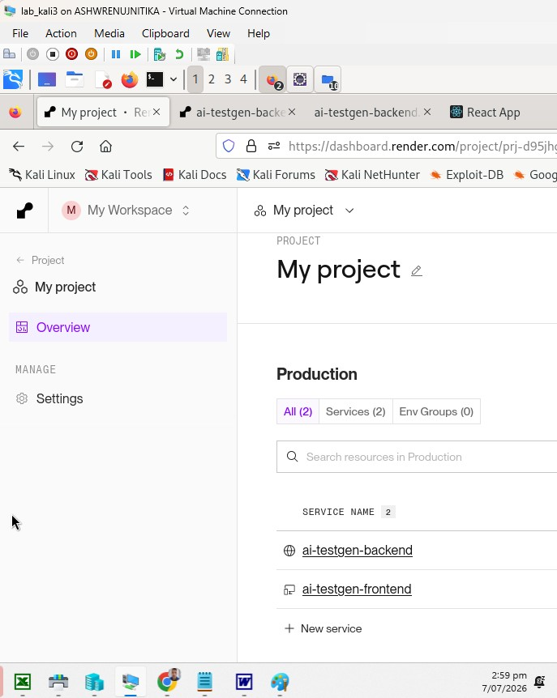 

b. Dynamic Test Case Generation with backend service utilizing AI:

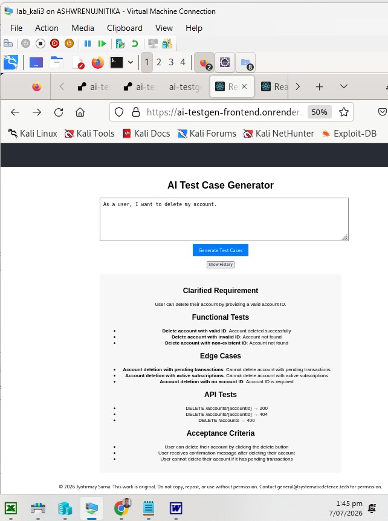

c. REACT SPA application shows history page of all queries made to date, via call to backend which hosts a database. 

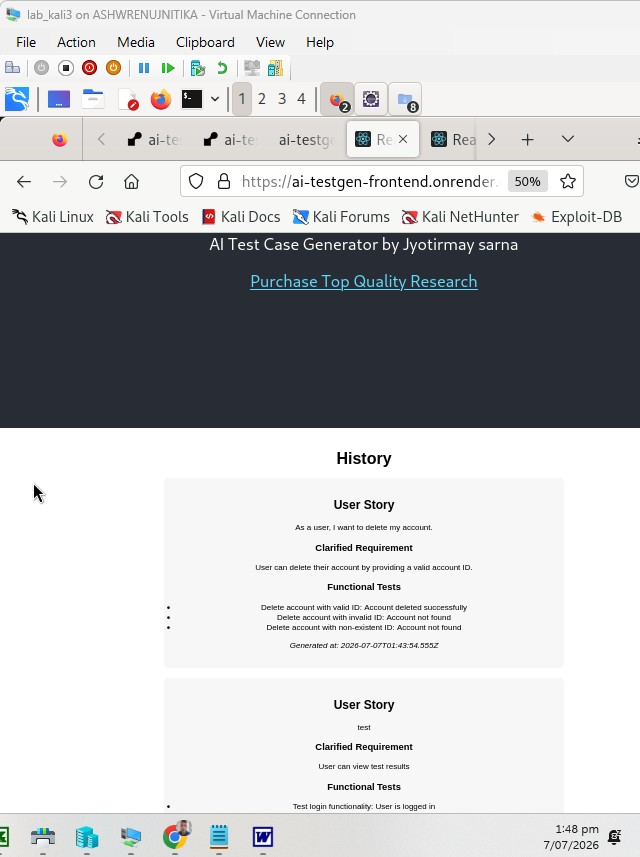

d. CI Pipeline passing

i) Continuous Integration Backend tests passing
 
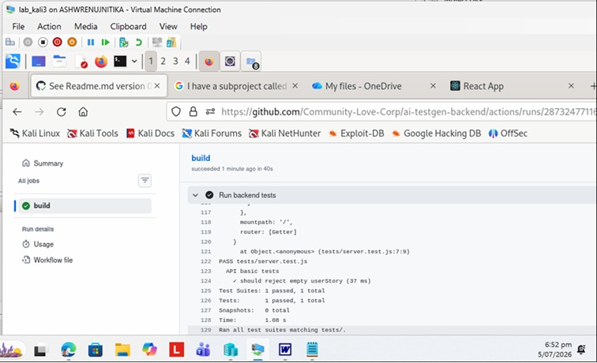

ii) Continuous Integration Frontend tests passing

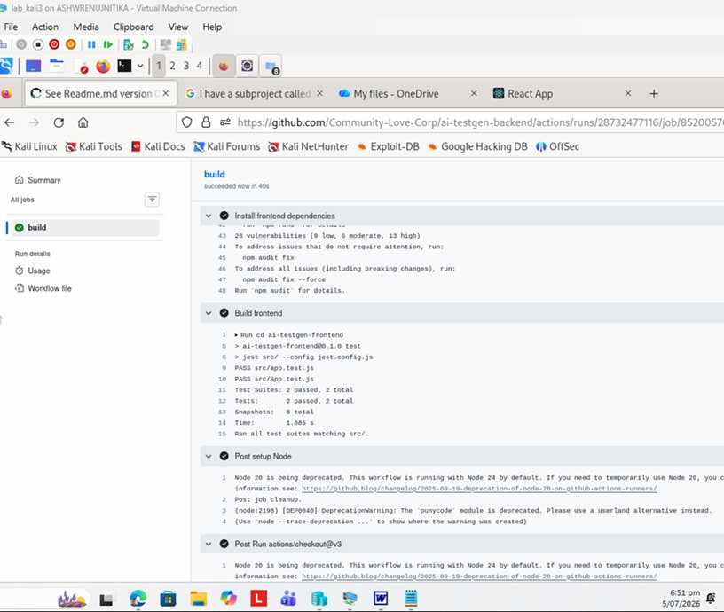


## 8.0 Versions

#### 0.01 Sunday 5 July 2026 17:41:

Initialised.

#### 0.02 Sunday 5 July 2026 18:31:

The backend test was failing in CI pipeline with error:

```
Error [ERR_REQUIRE_ESM]: require() of ES Module /home/runner/work/ai-testgen-backend/ai-testgen-backend/node_modules/@babel/core/lib/index.js from /home/runner/work/ai-testgen-backend/ai-testgen-backend/node_modules/babel-jest/build/index.js not supported.
Instead change the require of /home/runner/work/ai-testgen-backend/ai-testgen-backend/node_modules/@babel/core/lib/index.js in /home/runner/work/ai-testgen-backend/ai-testgen-backend/node_modules/babel-jest/build/index.js to a dynamic import() which is available in all CommonJS modules.
```

Fixed by 

a. Getting tests/server.test.js to call the app explicitly (without default keyword)

```
import { app } from "../server.js";//if you exported app
```

b. Getting server.js to start app without reference to default

```
export { app };
```

#### 0.03 Sunday 5 July 2026 18:45:

Changed node version in ci.yml to 22.

### 1.00 Monday 6 July 2026 17:45:

Made updates to frontend in order to enable it to communciate with backend in Production.

--OUTCOME--

a. Dynamic Test Case Generation with backend service utilizing AI:


b. REACT SPA application shows history page of all queries made to date, via call to backend which hosts a database. 


#### 1.01 Tuesday 7 July 2026 14:02:

Completed Readme (this document).

#### 1.02 Friday 17 July 2026 22:33:

App working locally. 

a. User now has to register to use QA AI tool 

i. Nav bar, when user logged out

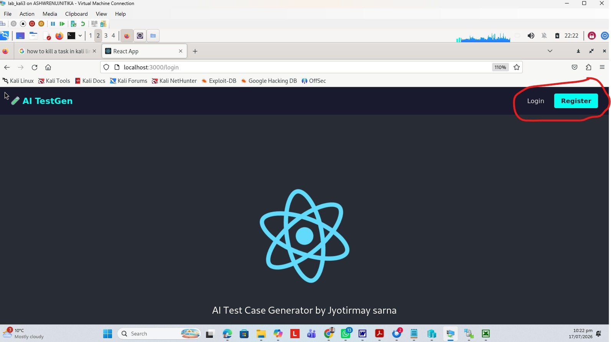

ii. Nav bar, when user logged in

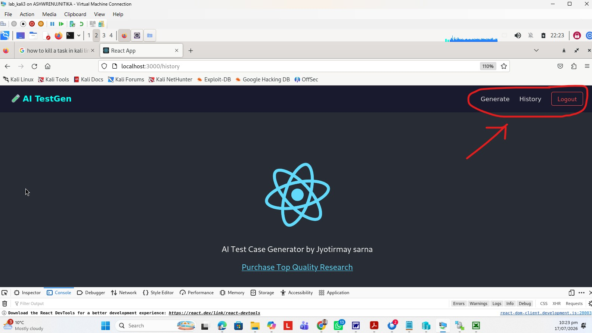

b. If Token expires, user made to login

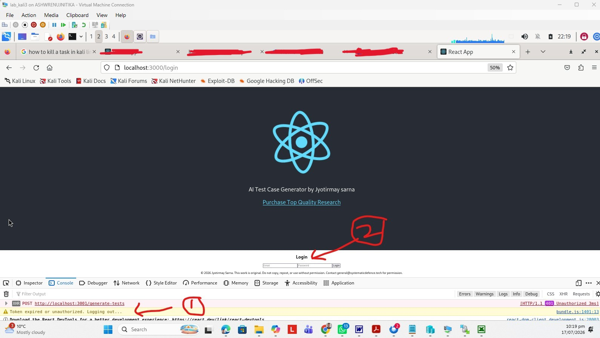

c. If user not logged in, app's features don't work

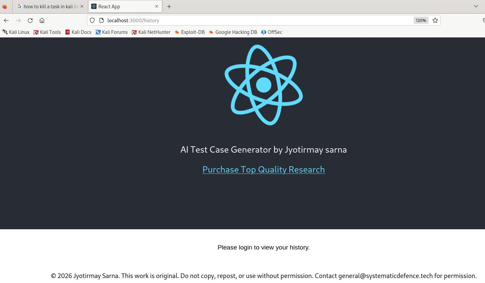

#### 2.0 Saturday 18 July 2026 

Email verification working

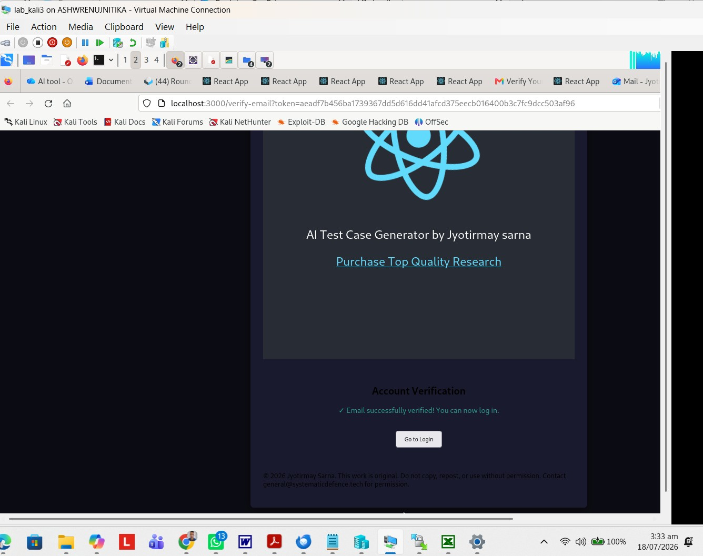

#### 3.0 Saturday 18 July 2026 14:25 HOURS - Deployment to Production

Preparation:

a) Setup .env for backend in Production: Environment group setup on render cloud in preparation for deployment to production, and associated with bankend service.

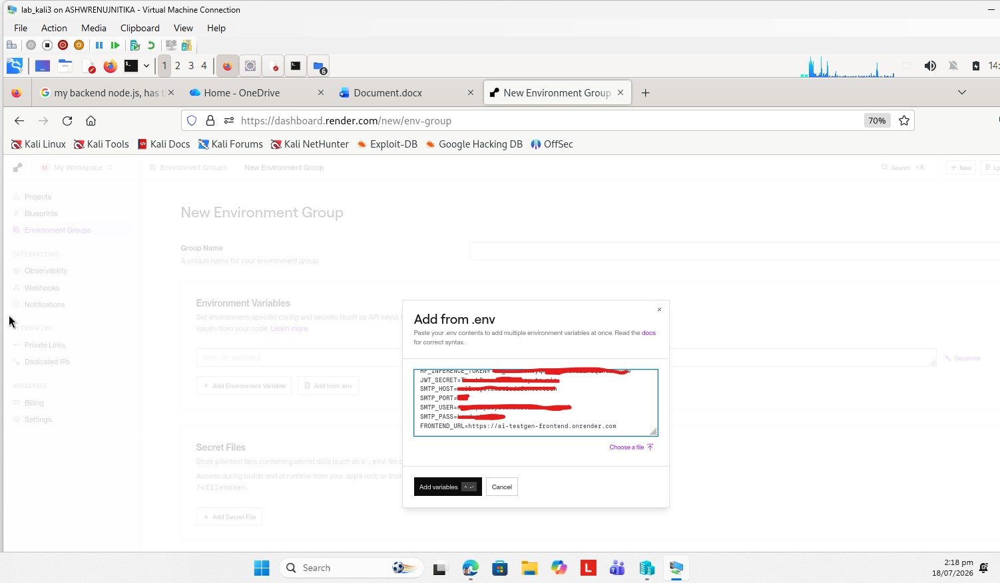

b) DB Migration

In this particular case, I had done very little with the database till now and its presence was cosmetic. This release adds user management to the application and properly implements : 

- 'history of generations' viewing and storing to the db.

Hence, the existing db was simply deleted via following steps:   

i.  Navigate to Render Dashboard> select backend service, 
ii. Click the Manual Deploy button in the top right. 
iii. Select Clear Build Cache & Deploy. 

#### 3.1 Saturday 18 July 2026 20:48 HOURS - Deployment to Production with fixes
  The Version 3 deployment had failed in Production because, in my locally running application
I started using absolute paths. However, in production, on render platform, I am using ephermal 
disk, which changes everytime the app restarts, so absolute paths will not work and each restart
will result in loss of all data. Since, I am creating a production app, I moved to a paid tier,
and provisioned a disk. 
  Further, I made other minor changes to improve accessibility and login.
  
#### 3.2 Sunday 19 July 2026 13:57 HOURS - Error handling

When trying to register a person already in the db, the error now says email already registered.

#### 3.3 Sunday 19 July 2026 15:15 HOURS - Prod DB confirmed as working, also backend url

Prod DB:

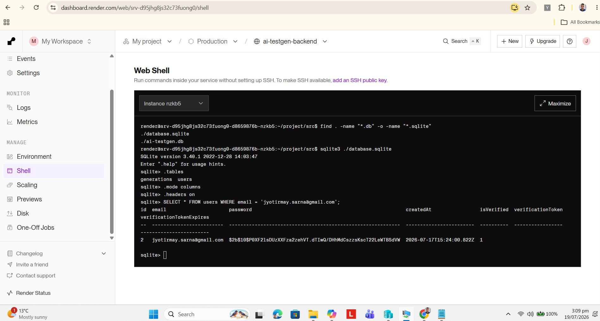

Prod Backend URL:

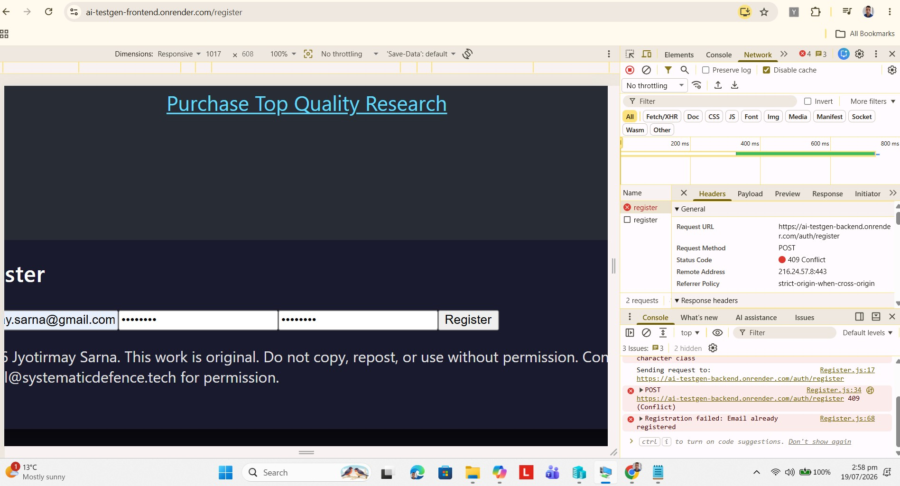

Rewrite Rule added to Frontend (React Single Page Application) to manage calls to non-homepage urls :

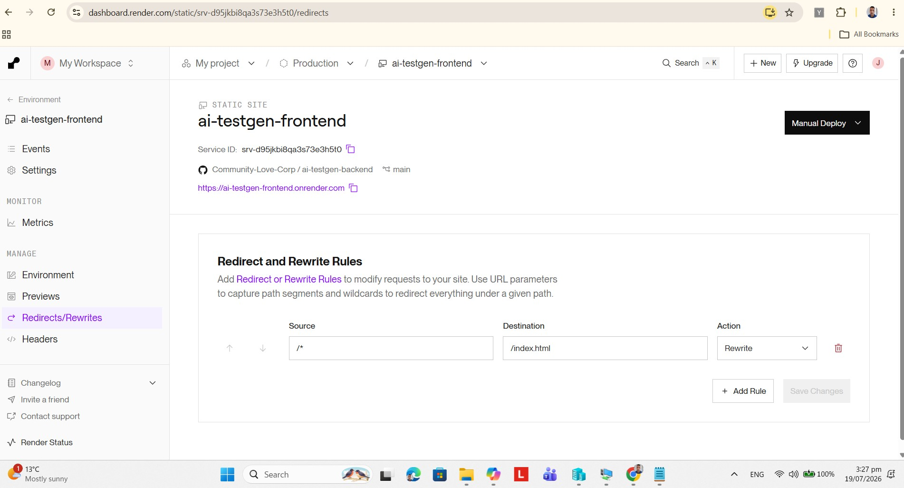